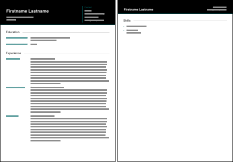

# lebenslauf

CV template for the ConTeXt document processing system. Manage multiple CV configurations (multiple languages, conditionally shown entries) with a single file and command line arguments.





## Usage

A basic document structure is provided in `template.tex`.

Select the language of the output document with the `--lang=` command line argument, e.g.

```bash
$ context --lang=en template.tex
```

Header texts for languages English (`en`) and German (`de`) are predefined. Other fields and languages can be added by setting the corresponding `multilangtext` key-value pairs (check out `lebenslauf.tex`).

Using the [modes](https://wiki.contextgarden.net/Modes) feature of ConTeXt with the `--mode=` command line argument, entries can be enabled and disabled on demand. Category headings should be hidden automatically if all entries in the category are hidden.

